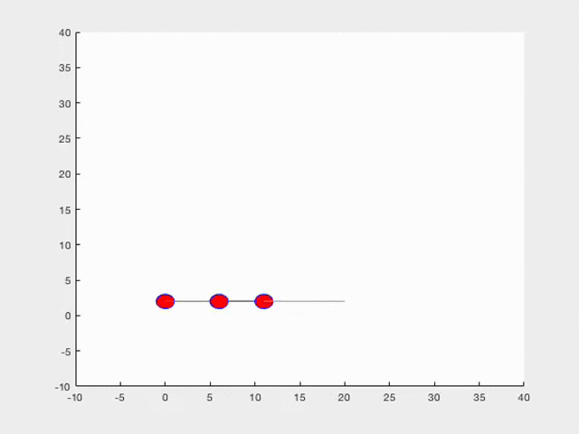
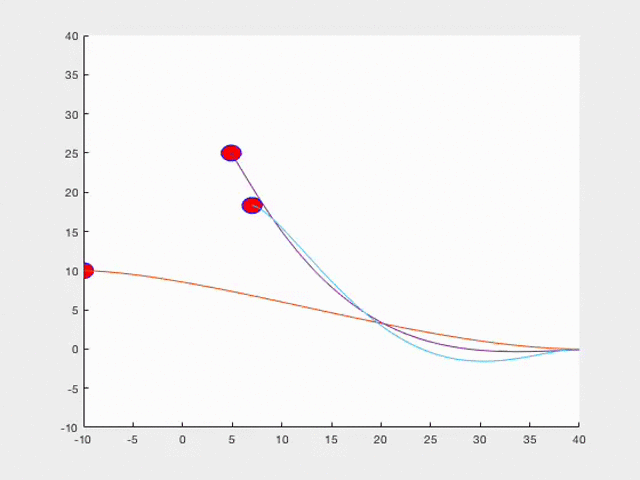

# MultiAgent Collision Avoidance With Scaling On Complex Trajectories. 

Give your configuration of the robot in MultiAgentCVX.m in function initalizeCars 

as 

```    
	t0=0;tf=20;    
    x0=0;y0=2;xw1=8;yw1=2;xf=16;yf=2;

```
Without scaling all the robots would collide, here only the results are shown
## Single line trajectories - Following Behaviour 



## Merging Behaviour in Smooth Trajectories



## Unstructured Trajectories 

